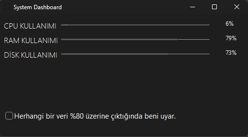

# 🖥️ System Dashboard (Python & PyQt6)


**Bilgisayarınızın CPU, RAM ve Disk kullanımını anlık olarak takip eden, sistem tepsisine (System Tray) küçülebilen ve görsel uyarı sistemine sahip modern bir masaüstü uygulaması.**

<p align="center">
  
</p>

## 🚀 Özellikler

* **📊 Canlı Takip:** `psutil` kütüphanesi ile saniyelik CPU, RAM ve Disk veri akışı.
* **⚠️ Akıllı Uyarı Sistemi:** Kaynak kullanımı belirlenen eşiği (Örn: %80) geçtiğinde kullanıcıyı görsel olarak uyarır (Sonsuz pop-up döngüsü engellenmiştir).
* **👻 Arka Planda Çalışma:** "Kapat" (X) tuşuna basıldığında uygulama kapanmaz, Sistem Tepsisine (System Tray) gizlenir.
* **🖱️ Tepsi Entegrasyonu:** Sağ alt köşedeki ikona çift tıklayarak açma veya sağ tık menüsü ile tamamen kapatma imkanı.
* **🎨 Modern Arayüz:** PyQt6 ve QProgressBar kullanılarak tasarlanmış temiz arayüz.
* **📦 Taşınabilir (Portable):** PyInstaller ile tek bir `.exe` dosyası olarak paketlenmiştir. Kurulum gerektirmez.

## 🛠️ Kurulum ve Çalıştırma

### Kaynak Koddan Çalıştırma
1. Repoyu klonlayın:
```bash
git clone [https://github.com/suleymanibis0/System-Dashboard.git](https://github.com/suleymanibis0/System-Dashboard.git)
cd System-Dashboard
```

2. Gerekli kütüphaneleri yükleyin:
```bash
pip install -r requirements.txt
```

3. Uygulamayı başlatın:
```bash
python main.py
```

## EXE Olarak İndirme
Kodlarla uğraşmak istemiyorsanız, [Releases](https://www.google.com/search?q=https://github.com/suleymanibis0/System-Dashboard/releases) kısmından son sürümü .exe olarak indirebilirsiniz.

## ⚙️ Kullanılan Teknolojiler
-> Python: Ana programlama dili.

-> PyQt6: Grafik arayüz (GUI).

-> psutil: Sistem verilerini (CPU/RAM/Disk) çekmek için.

-> ctypes: Windows görev çubuğu ikon entegrasyonu için.

## 🤝 Katkıda Bulunma
1. Bu projeyi Fork'layın.

2. Yeni bir özellik dalı (branch) oluşturun (git checkout -b feature/YeniOzellik).

3. Değişikliklerinizi commit edin (git commit -m 'Yeni özellik eklendi').

4. Dalınızı Push edin (git push origin feature/YeniOzellik).

5. Bir Pull Request oluşturun.

Developed by Süleyman İbiş